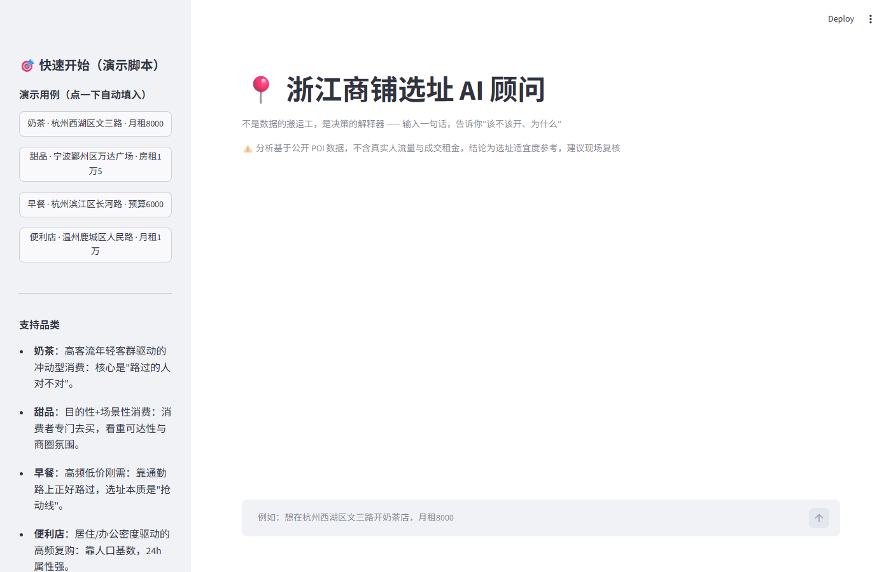
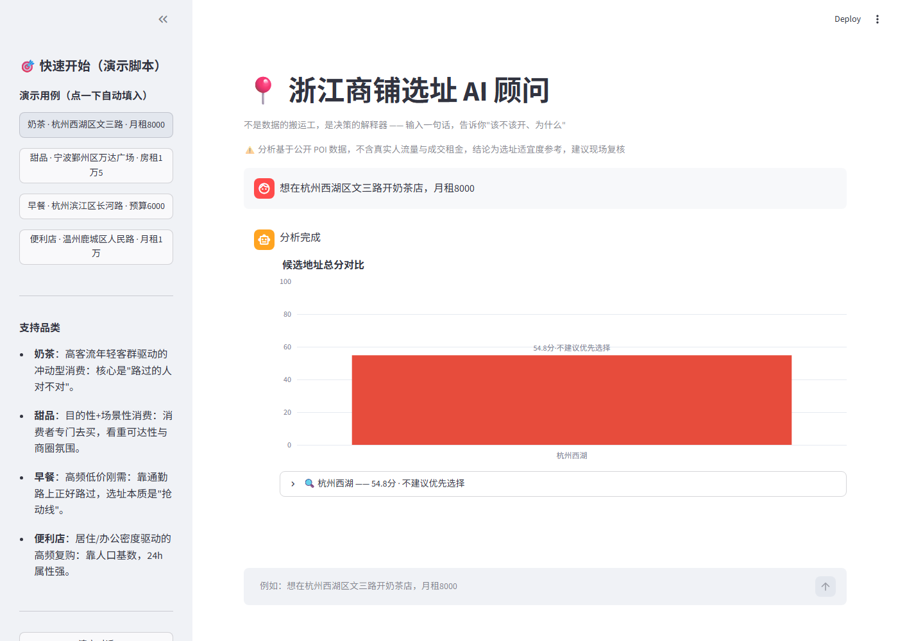

# 址南针 —— AI 商铺选址智能顾问

> **不是数据的搬运工，是决策的解释器。**
> 面向个人创业者的选址决策顾问：输入一句话，输出"该不该开、为什么、怎么算"。

<div align="center">


</div>

---

## 📌 项目简介

**址南针**是一个基于 **LangGraph 多阶段决策流 + Chainlit 对话界面**的商铺选址智能体。
用户只需用一句自然语言描述想开的店（品类、大致位置、租金、预算），Agent 就会：

1. **理解意图** —— 解析品类 / 地址 / 租金 / 面积 / 预算 / 客群
2. **实时抓取** —— 调用高德周边 POI 与 58同城真实在租店铺
3. **科学评分** —— 4 维度评分（客群匹配 / 竞争压力 / 交通可达 / 租金承受）+ Huff 引力模型
4. **盈利测算** —— 水电 / 人工 / 物料 / 固定成本 / 月净利 / 回本周期
5. **给出结论** —— 总分 + 推荐结论 + 口语化解读 + 风险提醒
6. **持续对比** —— 跨对话保存分析记录，可勾选 2-4 个历史分析做全方位对比（多雷达图 / 多列表格 / 柱状图）

全程**执行过程实时展开**、候选商铺**卡片一键选择**、分析结论**右侧工作台**集中呈现，并可导出 **PDF 报告**。

---

## 🚀 快速开始

### 环境要求
- Python 3.10+
- 一个高德开放平台 **Web 服务 key**（免费申请）
- 一个大模型 API key（支持火山方舟 / DeepSeek / 任意 OpenAI 兼容接口）

### 1. 安装依赖

```bash
pip install -r requirements.txt
```

### 2. 配置 API key

```bash
cp .env.example .env        # Windows: copy .env.example .env
```

在 `.env` 中填写（完整字段见 `.env.example`）：

| 变量 | 说明 |
|---|---|
| `AMAP_KEY` / `AMAP_SECRET` | 高德开放平台 Web 服务 key（POI / 周边搜索） |
| `LLM_API_KEY` / `LLM_BASE_URL` / `LLM_MODEL` | 主模型（火山方舟等 OpenAI 兼容接口） |
| `LLM_FALLBACK_API_KEY` 等 | 备用模型（主模型失败时自动降级） |
| `LLM_ARK_API_KEY` / `LLM_ARK_BASE_URL` / `LLM_ARK_MODEL` | 火山方舟模型配置 |

> ⚠️ **安全**：`.env` 已加入 `.gitignore`，**绝不提交到仓库**。泄漏 key 请立即到控制台吊销。

### 3. 启动

```bash
# Windows 双击即可
start_agent.bat

# 或手动运行
python -m chainlit run src/ui/app_chainlit.py --port 8502 --host 0.0.0.0
```

浏览器打开 **http://127.0.0.1:8502** 即可开始对话。

### Render 公网部署

仓库根目录的 `render.yaml` 已配置 Python 3.12、动态 `$PORT`、健康检查，以及
`playwright install --with-deps chromium`。在 Render 选择 Blueprint 部署即可自动执行。
如果使用已有 Web Service 而不是 Blueprint，请将 Build Command 设置为：

```bash
pip install -r requirements.txt && playwright install --with-deps chromium
```

Start Command 设置为：

```bash
python -m chainlit run src/ui/app_chainlit.py --host 0.0.0.0 --port $PORT
```

Render 环境变量仍需在控制台单独填写 `AMAP_KEY`、`AMAP_SECRET` 以及至少一个
`LLM_*_API_KEY`；不要上传 `.env`。公开演示需要设置 `DEMO_MODE=1`，并保留
`RATE_PER_MIN`、`RATE_PER_DAY`、`DAILY_BUDGET` 限流预算。

### 4.（可选）预抓取浙江省 POI 数据

评分默认使用**实时周边搜索**（冷门地址也能覆盖）；如需离线演示可预抓：

```bash
python src/data/fetch_poi.py
python src/data/query.py   # 查看数据状态
```

---

## 🧠 核心架构

```
site-selection-agent/
├── docs/
│   ├── 架构文档.md          # 系统设计文档
│   ├── 品类画像参数表.md     # 评分模型依据（4 品类画像）
│   └── screenshots/        # 演示截图
├── src/
│   ├── config.py           # 配置加载 + 品类画像参数
│   ├── data/
│   │   ├── fetch_poi.py    # 高德 POI 抓取（限速 / 幂等 / 磁盘缓存）
│   │   ├── fetch_around.py # 周边搜索抓取
│   │   └── query.py        # SQLite 本地查询
│   ├── engine/             # 确定性评分层（同一输入同一结果，不依赖 LLM）
│   │   ├── scoring.py      # 评分引擎（真 Huff 捕获份额 + 盈利一票否决 + 租金临界点反解）
│   │   ├── utilities.py    # 水电 / 成本 / 净利 / 回本测算
│   │   ├── brands.py       # 连锁品牌系数（Huff 吸引力 + 加盟政策参考）
│   │   ├── negotiation.py  # AI① 租金谈判：58 同商圈行情分布 + 承受力上限
│   │   ├── competitor_insight.py # AI④ 竞品口碑画像（高德公开字段）
│   │   └── realtime.py     # 实时周边搜索兜底
│   ├── agent/
│   │   ├── agent_graph.py  # LangGraph 多阶段决策流（对话编排核心）
│   │   ├── agent.py        # 选址领域逻辑层（口语抽取 / 地理编码 / 规则兜底解读）
│   │   ├── state.py        # 图状态定义
│   │   ├── llm.py          # 多模型 LLM 调用 / 切换
│   │   ├── vision.py       # AI③ 门头照 VLM 视觉分析
│   │   ├── knowledge.py    # AI② 选址知识库（RAG 检索）
│   │   ├── rental58.py     # 58同城真实在租店铺抓取
│   │   ├── analysis_store.py   # 分析结果持久化（跨会话对比）
│   │   └── conversation_store.py # 多会话管理
│   ├── analysis/           # 模型标定与回归（λ 标定 / 锚点标定 / 敏感性 / 端到端测试）
│   └── ui/
│       ├── app_chainlit.py # Chainlit 界面（唯一入口，含右侧工作台）
│       └── report_pdf.py   # PDF 报告导出
├── public/                 # 前端静态资源（自定义侧栏 / 工作台）
│   ├── sidebar.js          # 右侧工作台渲染（评分卡 / 雷达图 / 对比）
│   └── app.css
├── start_agent.bat         # Windows 一键启动
├── requirements.txt
└── .env.example            # 配置模板
```

### 多阶段决策流（LangGraph）

```
用户输入 → 意图识别
  ├─ 已给商铺地址 → 直接分析
  ├─ 未给地址     → 搜索候选商铺卡片 → 用户一键选择
  └─ 对比请求     → 列出历史分析卡片 → 勾选 2-4 个 → 全方位对比
分析阶段：抓周边 → 评分 → 盈利测算 → LLM 解读 → 保存记录
```

---

## 🏆 功能亮点

| 亮点 | 说明 |
|---|---|
| 🎯 **一句自然语言** | "我想在杭州开奶茶店，预算 20 万，月租 8000" 即可启动 |
| 🗺️ **真实数据** | 高德 POI + 58同城在租商铺，非演示假数据 |
| 📊 **可解释评分** | 4 维度指标卡 + 雷达图 + 证据引用（竞品引力比 / 客群密度 / 通勤距离） |
| 💰 **盈利测算** | 水电 / 人工 / 物料 / 固定成本 → 月净利 / 回本周期 |
| 🔄 **跨会话对比** | 历史分析保存，勾选 2-4 个做多雷达 / 多列表格对比 |
| 🃏 **卡片交互** | 候选商铺 / 历史分析均为卡片化一键操作 |
| 📄 **PDF 报告** | 一键导出完整选址分析报告 |
| 🌙 **深色模式** | 适配深色 / 浅色主题 |

---

## 📸 界面预览

| 首页引导 | 分析结果 | 对比工作台 |
|---|---|---|
|  |  |  |

---

## ⚠️ 已知局限（答辩必讲）

- 基于公开 POI 数据，**不含真实人流量 / 成交租金 / 交易数据**
- 输出为**选址适宜度相对评分**，不是营收预测
- 建议**现场实地复核**后再做最终决策
- 免费高德 key 有每日配额，脚本已内置限速与失败降级

---

## 🛠️ 技术栈

- **界面**：Chainlit 2.x + 原生 JS/CSS（右侧工作台）
- **Agent 编排**：LangGraph（多阶段状态图）
- **评分模型**：Huff 引力模型 + 多维度加权
- **LLM**：火山方舟 / DeepSeek（OpenAI 兼容，可扩展）
- **数据**：高德开放平台 API + SQLite 本地缓存 + Playwright 网页抓取
- **报告**：Playwright 渲染 PDF

---

## 📄 License

仅供学习与比赛交流使用。
